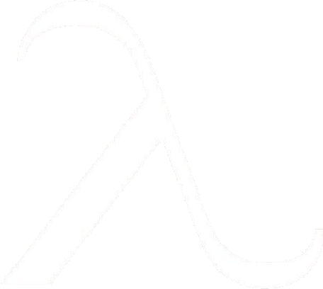
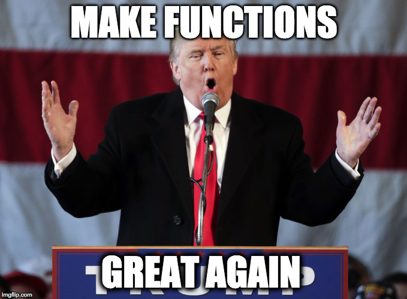
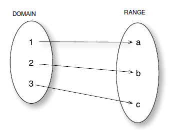
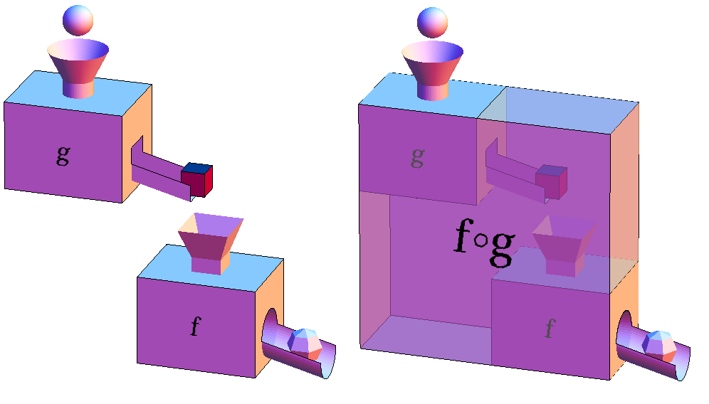
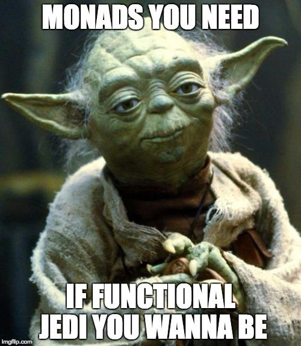
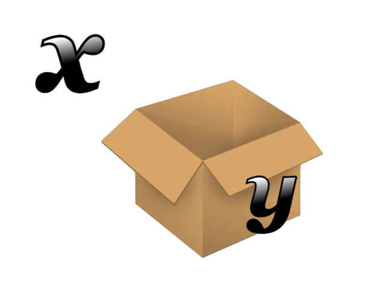

- title : What the FUNctional ??!?!!
- description : Introduction to Functional Programming
- author : Stefano Paluello
- theme: league
- transition : convex

***

# WTF??!
( **W**hat **T**he **F**UNctional ??! )

 

Intro to Functional Programming

 
 
Stefano Paluello  [@palutz](http://www.twitter.com/palutz)

***

###Learn **functional** the "hard" way
_(High level, abstract, agenda)_

 

* Hard => no watered-down version
* ( _Fast paced_ ) Intro of functional programming concepts
* Not focusing on any particular language or implementation
* Examples in pseudo-code (javacript-like)

' FP has a lot of "small" concepts that I will try to tackle in this presentation
' All together look a big, but step by step it's much easier

---

What is Functional Programming?

 

---

**Functional programming** is a declarative programming paradigm that emphasizes the
_evaluation of expressions_ , rather than execution of commands.

The expressions in these languages are formed by using functions to combine
basic values. [Hutton ed. 2002]

' declarative programming = programming is done with expressions or declarations instead of statements. 
' Declarative = WHAT 
' Imperative = HOW

---

### Imperative vs Declarative

Imperative

    (array) => {
      var res = [];
      for (i = 0; i < array.length; i++) { 
        res[i] = res[i] * 3;
      }
    }

Declarative

    (array) => array.map(item => item * 3);

---

### Core concepts

* Functions as first-class citizen
* Immutability
* Purity
* Referential transparency

' What are the most important concepts that define functional programming

---

First class ? Purity? Referen..what ??? 

 

' this could be a bit confusing.. so let's dive into...

---

### Don't worry! It's all about ...

***

 

 

---

## Functions as first-class citizen

 

* pass functions as arguments
* return functions as result
* bind functions to a variable (name)
* store functions in data structure
* support _function literals_ (aka, anonymous functions)
* strive to use **pure** functions

 

---

## A bit of FP jargon

 

  - **HOF (High order functions)**

    + Functions that take other functions as arguments or returns them as results

  - **Pure functions**

    + function result depends only on the input received
    + function does not cause any (observable) **side effects**

---

### "First-class" examples

  (Using Javascript as pseudo-language)

    // binding a function to a variable
    var hello = function(name) {
      return "Hello " + name;
    };
    typeof(hello) // function  <--- !!!

' binding = attach a name to a function (function itself is independent of the name)

---

### "First-class" examples

  (High Order functions)

    // Example of HOF in Javascript:
    var doSomeStuffHOF = function(callback) {
        // ... 
        return anotherHOF(callback);
    }
    // ex2: filter is a HOF ...
    function isAdult(person) {
       return person.Age >= 18;
    }
    var adults = contacts.filter(isAdult);
    // ex3: receiving and returning a function...
    var f1 = function(h2) { // ...
      function inner() {// ...  };
      return inner;
    };
    var aHOF = f1(function() { ... });   // typeof(aHOF) -> function
    aHOF(); // actual call... 

'  most of the functions in JS accept a callback function as input parameter
'  Example 2 is a bit more elaborate: we define a function and then we used as a predicate for a filter function
'  Example 3 just returning an inner function

---

### "First-class" examples

>  Anonymous functions (or literals)
>
> It's a function declared without any named identifier to refer to it.

    (function(msg) {
      alert(msg);
    })('A simple message');

 

***

### Pure functions

(or _Mathematical functions_ )

 

* A pure function ALWAYS gives the same result for a given input value
* A pure function depends only on the input provided to produce the result
* A pure function has no (observable) side effects

' A pure function maps the set of input (domain) to a set of output (range)

---

### Pure functions

A (pure) function maps the _domain_ onto the _range_

 

(pure) Function doesn't have any effect on the input value(s)

---

### Side effects

 
 
 

** x++ **

_(syntactic sugar for x = x + 1 )_

 

_** Why can we do that in FP ??? **_

' Classic example of no side effects: x++
' we are changing the value of x
' math functions don't allow this cause it doesn't exist in math (no way I can find a value x that is also x + 1 at the same time)

---

### Immutability

Immutable data => Unchanging over time or unable to change

Don't be so scared: it's already there in almost any language (a string is immutable)

    const x = "Hello";
    x = x + ", World!";   // ERROR - CANNOT CHANGE x
    y = x + ", World!";   // OK - create a new string with the new value
    // x = "Hello"
    // y = "Hello, World!"

' Why is immutability important?
' We need to attach unchanging values to our functions.
' Value that don't depend on a context
' Values are easier to share
' safer and easier to do parallel programming

---

### NO Side effects

 

The input (x) is not changed

We create a new value and maps the output with the input

 

#### y = x + 1

 

' For every input we will get always the same output (map)

--- 

### Pure not pure?

 

    const a = 3;
    var y = function(x) {
        return x * a;
    }

 

Is the function *Y* pure?

' No! The function y is using a value (a) not passed as input

--- 

### Pure not pure?

 

    const a = 3;
    var y = function(x, a) {
        return x * a;
    }

 

Is the function *Y* pure?

' Yes. Really similar to before but using the a received as parameter

---

### Pure not pure?

 

    function(x) {
      var a = getValueFromWeb(...);
      if(a > 100)
        return a;
      else 
        return x;
    }

 

Is the function pure?

' No! We are dealing with an EXTERNAL service.

---
 
### Pure not pure?

 

    function(myarray) {
      myarray.reverse(); // ... tricky! 
    }

 

Pure or not?

' No! In JS the reverse function is changing the input

---
### Pure not pure?

 

    // log to the console...
    console.log("Pure or not pure? That is the question.");

 

Pure or not?

' No! Writing to console is SIDE EFFECT! (observable iteraction with the external world)

---

### Why pure is so important ?

 

* Functions are easy to cache
* Functions are easy to port and the code is auto-documenting
* Functions are easy to test
* Functions can be parallelized with (almost) no effort
* **Referential transparency** (!!!)

' cache => returns always the same output for the same input

' Pure functions are self contained (easy to port)with EXPLICIT (injected) dependencies.

' Pure functions with explicit dependencies => easy to test

' No side effects, not sharing anything => No problem to create parallel code

---

### Pure vs impure

 

    // impure
    var register = function(formval) {
      var user = createUser(formVal);
      greet(user);
      // ...
    }

    // pure - remember anything?
    var register = function(dbSvc, greetSvc, formVal) {
      return function() {
        var user = createUser(dbSvc, formVal);
        greet(greetSvc, user);
        // ...
      }
    }

'  The pure code looks a lot like a proper DI OOP code

---

### Referential transparency

 

    var Add1 = function(x) {
      return x + 1;
    }
    var six = Add1(5); 
    // we can always substitute Add1(5) with its own evaluation and viceversa...

' Pure function allows to substitute the name of the function (the bind between a name and the function itself)
' with its evaluated value without affecting the behavior of the program.

---

### Tricky part of math functions

 

* Input and output values are immutable!
* Math functions always have only one input and one output

' quite important concepts to remember and sometimes difficult to deal with
' how do we deal with only one input and pne output

***

### Core concepts (2)

 

* Currying (not the spice) 
* Partial application
* Functions composition

 

---

### Currying

 

AKA: how to deal with only one input and one output

_[Simple mode on]_
> You can call a function with LESS araguments and
> you will get back another functions with the remaining arguments

_[Simple mode off]_

 

' for the one interested the name is taken from Haskell Curry a mathematician
' who had a big influence, with his work, on functional programming (hence the name of the most popular pure functional language)

---

### Currying

 

(this is more pseudo code than js)

    function add x y = x + y

    var add1 = add x + 1   // function with one parameter

    var c = add1 2  // c = 3

---

### Partial function application

(AKA, currying on steroids)

Currying works decomposing a function in smaller chunks, one parameter at time.

Partial application use the same concept, but with more parameters (eg. 3 out of 5)

You can design library with partial function in mind (ordering the parameter)

' List.map ... the list is the last parameter
' put first the parameter more likely to be static and last most changing (eg data structure or collection)
' this make easier to pipe

---

### Functions composition

 

 

 

' f * g => it's a functional composition meaning f composed with g, or f after g 

---

### Functions composition 

Short explanation...

 

    f * g   // f composed with g

    (f * g)(x)   // or, call f after call g with x

    f(g(x))    // other way to write the same thing

***

 

 

 

---

### Mondas' hype

 

Monads is the most discussed, feared and (in)famous concept behind functional programming.

> DISCLAIMER: you don't need to use Monads to start programming in a functional way.
>
> DISCLAIMER2: understanding them won't hurt you and could be beneficial ;-) 

---

Never heard about Monads, why hype?

 

 

Source: HaskellWiki

 

PS: not aiming to be YATAM (Yet Another Tutorial About Monads), just a fast explanation (hopefully)

---

### What is a Monad?

 

> A Monad is just a **monoid** in the category of the **endofunctors**

 

---

 

 

 

---

### Making it easier...

Let's make some assumptions:

- We all know what is a category (general speaking)
- We don't know monoid, hence we call it _x_
- We don't know endofunctors, hence we call it _y_

 

---

And... What do we get it here?

> A Monad is just a **x** in the category of **y**

 

> Think about Monad as a "container"

---

### Category theory

Let's not even start:

> Monoid, Functors, Applicatives, Monads... 

And this is the "cheat sheet".. 

 

 Source: HaskellWiki (again...)

 

' Category Theory : abstract math to study relationship between objects
' Category: it's a math concept to study relationship
' Monoid: a category of only one object (eg: multiplication. All Numbers as relationship between the World and itself
' Functor: value "boxed" in a context and we want to apply a function f returning a value v2 to the simple value (eg: map )
' Applicatives: like functors but also the function f to apply is boxed
' Monad: take a wrapped value, a function f returning a wrapped v2, works together

***

### Most (in)famous Monads

 

- **Writer** Monad
- **Reader** Monad
- **State** Monad

 

---

### Writer Monad

 

- Bind a value in the Monad
- Manage alongside a writer (usually a log)
- Compose all your operations
- get the results and the log

 

---

### Reader Monad

 

- Particular monad: bind only one value
- add functions to the monad and then apply to a state
- workflow: get the f out of the Reader, pass in the state s, apply f to s => Reader2
- get the function from Reader2, run it (pass a State), get the new value out

 

---

### State Monad

- it's a ReadWrite Reader Monad
- get State with _get_ , change State with _put_
- workflow: run to get the function f, apply f to State s
- ... : get back the State Monad => ([result of f], modified State)

 

---

 

 

*** 

### Thank you!

 

* https://about.me/stefanop
* https://github.com/palutz
* https://twitter.com/palutz

 

 

> Made with [FsReveal](http://fsprojects.github.io/FsReveal/index.html)
